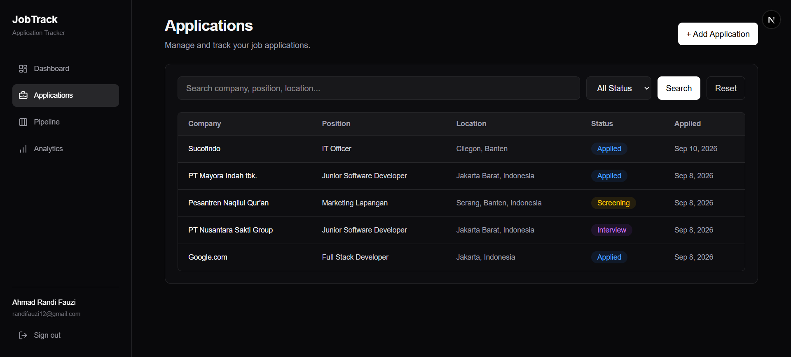
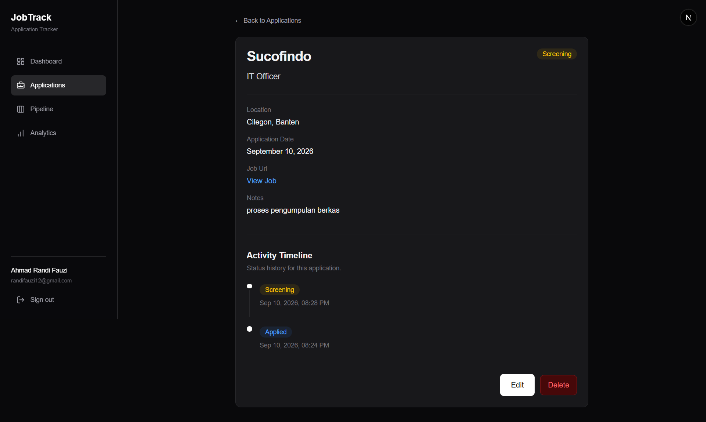
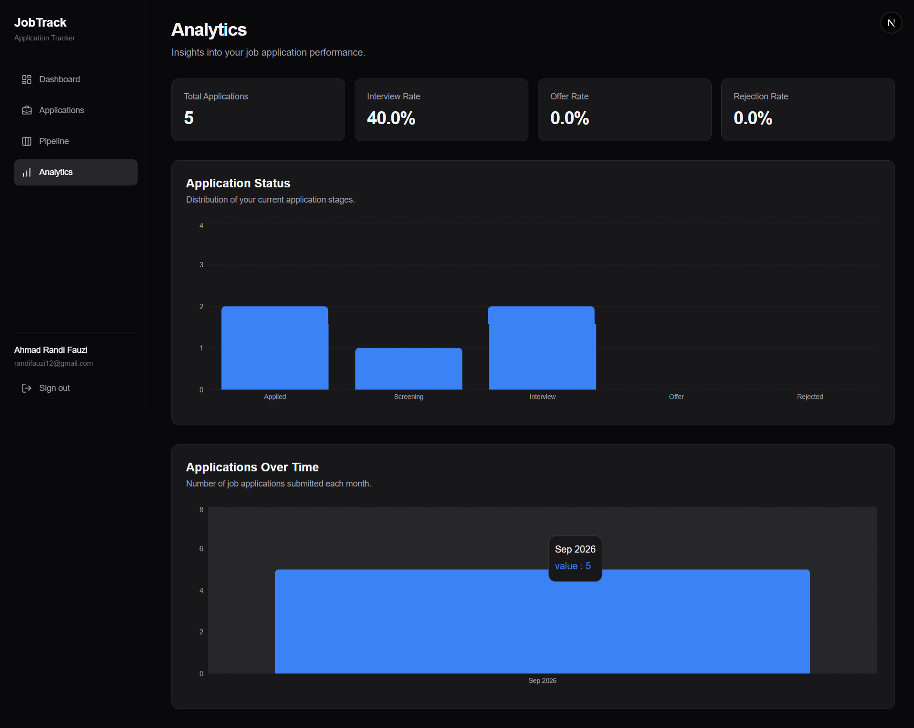
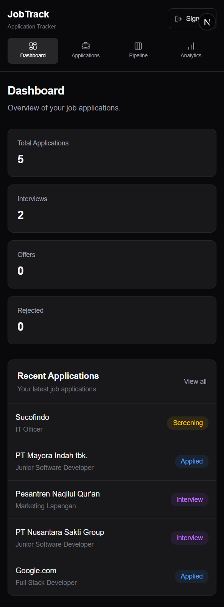

# Live Demo

JobTrack is deployed on Vercel and available as a live production application.

Live Demo: https://YOUR-JOBTRACK-URL.vercel.app

Create an account to explore the dashboard, manage job applications, track recruitment progress, and view analytics.

# Preview

Dashboard

Get a quick overview of your job search progress, including total applications, interviews, offers, rejections, and recent application activity.


Application Management

Manage all job applications in one place. Users can create, search, filter, view, edit, and delete applications while keeping each account's data isolated.


Application Details & Activity History


View detailed information about each application and track its recruitment journey through the activity history.

Every status change is recorded, providing a clear timeline of the application's progress.

Recruitment Pipeline


Visualize job applications through a recruitment pipeline consisting of Applied, Screening, Interview, and Offer stages.

Users can move applications between recruitment stages while JobTrack automatically records their status history.

Analytics


Monitor job search performance through statistics and data visualizations based on application activity and recruitment status.

Responsive Design


JobTrack is designed to work across desktop and mobile devices, providing access to application tracking wherever the user needs it.

# JobTrack

A modern full-stack job application tracking platform built to help job seekers organize applications, monitor recruitment progress, and visualize their job search activity.

JobTrack provides a centralized dashboard for managing job applications from the initial application stage through screening, interviews, offers, or rejection.

## Features

- Secure user registration and authentication
- Multi-user application ownership
- Create, view, edit, and delete job applications
- Track recruitment status:

  - Applied
  - Screening
  - Interview
  - Offer
  - Rejected

- Kanban-style recruitment pipeline
- Application status history
- Search and filter applications
- Job application analytics
- Dashboard statistics and recent activity
- Form validation and error handling
- Responsive interface for desktop and mobile
- Secure server-side data access

## Tech Stack

### Frontend

- Next.js
- React
- TypeScript
- Tailwind CSS
- Lucide React
- Recharts

### Backend

- Next.js Server Actions
- Auth.js / NextAuth
- Prisma ORM

### Database

- PostgreSQL
- Prisma Postgres

### Deployment

- Vercel

## Application Workflow

JobTrack allows users to manage applications through the following recruitment pipeline:

```text
Applied
   ↓
Screening
   ↓
Interview
   ↓
Offer
```

An application can also be marked as `Rejected` during the recruitment process.

Every status change is recorded in the application's activity history.

## Authentication & Data Security

JobTrack implements credential-based authentication using Auth.js.

Passwords are securely hashed before being stored in the database.

Application data is associated with the authenticated user through a `userId`, ensuring users can only access and modify their own job applications.

Server-side ownership checks are performed when accessing or modifying application data.

## Database Structure

The application uses three primary models:

### User

Stores registered user accounts and authentication information.

### Application

Stores job application information such as:

- Company
- Position
- Location
- Application status
- Job URL
- Notes
- Application date

Each application belongs to one user.

### ApplicationHistory

Stores the status history of an application, allowing JobTrack to maintain a timeline of recruitment progress.

Relationship overview:

```text
User
 │
 │ 1:N
 ▼
Application
 │
 │ 1:N
 ▼
ApplicationHistory
```

## Dashboard

The dashboard provides a quick overview of job search activity, including:

- Total applications
- Interviews
- Offers
- Rejected applications
- Recent applications

This allows users to quickly understand the current state of their job search.

## Pipeline

The Pipeline page provides a visual representation of the recruitment process.

Applications are grouped into:

```text
Applied → Screening → Interview → Offer
```

Users can move applications through different recruitment stages while JobTrack automatically records their status history.

## Analytics

JobTrack provides analytics to help users understand their job search performance.

The analytics dashboard includes application statistics and visualizations based on recruitment status and application activity.

## Getting Started

### Prerequisites

Make sure you have installed:

- Node.js
- pnpm
- PostgreSQL

### Installation

Clone the repository:

```bash
git clone https://github.com/yorandi/jobtrack.git
```

Navigate to the project:

```bash
cd jobtrack
```

Install dependencies:

```bash
pnpm install
```

## Environment Variables

Create a `.env` file in the project root:

```env
DATABASE_URL="your_postgresql_connection_string"
AUTH_SECRET="your_auth_secret"
AUTH_TRUST_HOST=true
```

Generate an Auth.js secret using:

```bash
npx auth secret
```

Never commit your `.env` file or production credentials to the repository.

## Database Setup

Generate the Prisma client:

```bash
npx prisma generate
```

Apply database migrations:

```bash
npx prisma migrate deploy
```

For local development where new migrations need to be created:

```bash
npx prisma migrate dev
```

You can inspect the database using:

```bash
npx prisma studio
```

## Running Locally

Start the development server:

```bash
pnpm dev
```

Then open the local development URL shown in your terminal.

## Production Build

Create a production build:

```bash
pnpm build
```

Run the production server:

```bash
pnpm start
```

## Project Structure

```text
app/
├── (dashboard)/
│   ├── applications/
│   ├── analytics/
│   ├── pipeline/
│   ├── layout.tsx
│   └── page.tsx
├── api/
│   └── auth/
├── login/
├── register/
└── layout.tsx

components/
├── application-form.tsx
├── edit-application-form.tsx
├── sidebar.tsx
└── status-badge.tsx

lib/
├── auth-user.ts
├── prisma.ts
└── validations/

prisma/
├── migrations/
└── schema.prisma

types/
└── next-auth.d.ts

auth.ts
auth.config.ts
proxy.ts
```

## Key Engineering Concepts

This project demonstrates practical implementation of:

- Full-stack TypeScript development
- Server-side rendering
- Server Actions
- Authentication and authorization
- Password hashing
- Multi-user data isolation
- Relational database design
- Prisma ORM
- Database migrations
- CRUD operations
- Schema validation
- Search and filtering
- Data visualization
- Responsive UI development
- Production deployment

## Future Improvements

Potential future improvements include:

- Drag-and-drop Kanban pipeline
- Application reminders
- Interview scheduling
- Resume tracking
- Advanced analytics
- Application export
- Email notifications
- OAuth authentication
- Automated testing

## Author

**Ahmad Randi Fauzi**

Software Developer focused on building modern web applications and continuously improving skills in full-stack and backend development.

GitHub: `@yorandi`

## License

This project is intended for educational and portfolio purposes.
